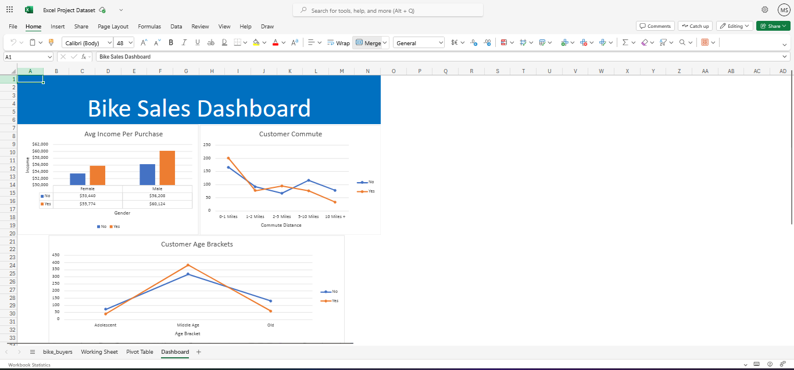

# 🚲 Excel Dashboard: Bike Buyer Analysis

This Excel project explores patterns and trends in customer data to identify factors that influence bike purchases. The project includes data cleaning, pivot table analysis, and an interactive dashboard built in Excel.

## 📊 Project Overview

- **Dataset**: Contains demographic, income, and lifestyle attributes of individuals.
- **Goal**: Discover which customer profiles are most likely to purchase a bike.
- **Approach**: Cleaned and analyzed the data using Excel, built pivot tables, and created a dashboard to visualize key insights.

## 📸 Screenshots

### Dashboard Overview

## 🧩 Dataset Features

- **Demographics**: Age, Gender, Marital Status, Education, Occupation
- **Finance & Lifestyle**: Income, Car Ownership, Commute Distance
- **Target**: Purchased Bike (Yes/No)

## 📌 Key Insights

- 📈 Higher income levels correlate with a greater likelihood of bike purchases
- 👨 Males tend to buy bikes more than females in this dataset
- 🧓 Age brackets and job roles show distinctive buying trends
- 🧭 Some regions have stronger purchase rates than others

## 🛠 Tools Used

- Microsoft Excel
  - Pivot Tables
  - Data Filtering & Sorting
  - Charts (Bar, Pie, Column)
  - Dashboard Layout Design

## 🧠 Skills Demonstrated

- Data cleaning and transformation
- Exploratory Data Analysis (EDA)
- Pivot table creation for group-based analysis
- Interactive dashboard design
- Business insight communication using visuals

